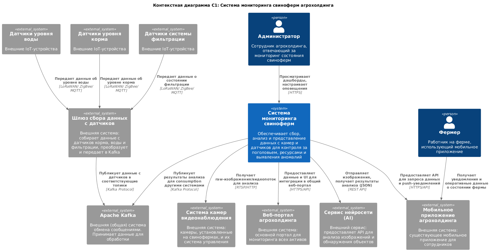
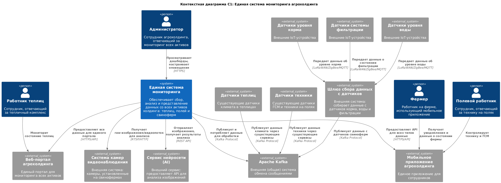

### **Название задачи: Выбор архитектуры системы мониторинга свиноферм** 
### **Автор: Архитектор агрохолдинга**
### **Дата: 08.09.2025**
### **Функциональные требования**
Опишите здесь верхнеуровневые Use Cases. Их нужно оформить в виде таблицы с пошаговым описанием.
|**№**|**Действующие лица или системы**|**Use Case**|**Описание**|
| :-: | :- | :- | :- |
| 1 | Система камер, Сервис сбора данных | Обработка изображений со свиноферм | 1. Камеры передают изображения/видеопоток 2. Сервис получает изображения и вызывает AI API 3. Результаты анализа публикуются в Kafka |
| 2 | Шлюз датчиков, Система мониторинга | Сбор данных с датчиков ресурсов | 1. Датчики воды/корма/фильтрации передают данные шлюзу 2. Шлюз агрегирует и преобразует данные 3. Данные публикуются в Kafka |
| 3 | Аналитический модуль | Анализ данных и детекция аномалий | 1. Потребление данных из Kafka (AI-результаты + датчики) 2. Агрегация показателей и выявление аномалий 3. Сохранение результатов в БД |
| 4 | Веб-портал, Мобильное приложение | Предоставление данных пользователям | 1. Клиенты запрашивают данные через API 2. API возвращает агрегированные данные и метрики 3. Отображение данных в UI |
| 5 | Сервис уведомлений | Генерация и отправка оповещений | 1. Получение событий аномалий из Kafka 2. Формирование сообщений по шаблонам 3. Отправка уведомлений через email/push/SMS |

### **Нефункциональные требования**
Опишите здесь нефункциональные требования и архитектурно значимые требования.

|**№**|**Требование**|
| :-: | :- |
| 1 | **Масштабируемость**: Система должна поддерживать горизонтальное масштабирование для обработки данных с до 1000 камер и 5000 датчиков |
| 2 | **Производительность**: Время от получения изображения до появления обработанных данных в UI не должно превышать 30 секунд |
| 3 | **Надежность**: Обеспечение доступности системы на уровне 99.9%, гарантированная доставка сообщений без потерь |
| 4 | **Безопасность**: Все данные должны передаваться по шифрованным каналам (HTTPS/TLS), обязательная аутентификация и авторизация |
| 5 | **Совместимость**: Полная интеграция с существующими системами (Kafka, веб-портал) без нарушения их работы |
| 6 | **Отказоустойчивость**: Система должна продолжать работу при выходе из строя отдельных компонентов |
| 7 | **Мониторинг**: Возможность мониторинга состояния всех компонентов системы в реальном времени |
| 8 | **Поддержка**: Возможность обновления компонентов системы без полной остановки работы |

### **Решение**
Приведите диаграммы контекста и контейнеров в модели C4. Опишите там основные компоненты и интеграции всех элементов решения.

Также опишите, какой логикой вы руководствовались в ходе принятия решений и выбора технологий. Не забывайте, что необходимо учесть все функциональные и нефункциональные требования.

@startuml
!include <c4/C4_Context>

Person(admin, "Администратор", "Сотрудник агрохолдинга")
Person(farmer, "Фермер", "Работник на ферме")

System(swine_monitoring, "Система мониторинга свиноферм", "Обеспечивает сбор, анализ и представление данных")

System_Ext(cameras, "Система камер", "Камеры видеонаблюдения на свинофермах")
System_Ext(sensor_gateway, "Шлюз датчиков", "Сбор данных с датчиков воды, корма и фильтрации")
System_Ext(ai_service, "Сервис нейросети", "Внешний AI API для анализа изображений")
System_Ext(kafka, "Apache Kafka", "Общая система обмена сообщениями")
System_Ext(portal, "Веб-портал", "Существующий портал агрохолдинга")
System_Ext(mobile_app, "Мобильное приложение", "Существующее мобильное приложение")

Rel(admin, swine_monitoring, "Просмотр дашбордов, настройка оповещений", "HTTPS")
Rel(farmer, mobile_app, "Получение уведомлений и данных", "Mobile")

Rel(cameras, swine_monitoring, "Передает изображения/видеопоток", "RTSP/HTTP")
Rel(sensor_gateway, kafka, "Публикует данные датчиков", "Kafka Protocol")
Rel(swine_monitoring, ai_service, "Вызов API анализа изображений", "REST API")
Rel(swine_monitoring, kafka, "Публикует/потребляет данные", "Kafka Protocol")
Rel(swine_monitoring, portal, "Предоставляет данные для интеграции", "HTTPS/API")
Rel(swine_monitoring, mobile_app, "Предоставляет API для мобильного приложения", "HTTPS/API")
@enduml

*Рисунок: Контекстная диаграмма системы мониторинга*

**Архитектурный подход:**
Выбрана **микросервисная архитектура** как наиболее подходящая для решения поставленных задач. Данный подход обеспечивает:

- **Независимое масштабирование** компонентов системы
- **Разделение ответственности** между сервисами
- **Гибкость разработки и развертывания**
- **Устойчивость к отказам** отдельных компонентов

**Выбор технологий:**

1. **Apache Kafka** - обеспечивает надежную доставку сообщений и буферизацию данных между сервисами, что соответствует требованию гарантированной доставки без потерь

2. **Отдельный AI Gateway Service** - инкапсулирует всю логику взаимодействия с внешней нейросетью, обеспечивая:
   - Изоляцию изменений внешнего API
   - Кеширование и retry-логику
   - Преобразование форматов данных

3. **API Gateway** (Spring Cloud Gateway) - предоставляет единую точку входа для клиентов и централизует:
   - Аутентификацию и авторизацию
   - Rate limiting
   - Маршрутизацию запросов

### **Альтернативы**
Опишите здесь наиболее важные альтернативные решения.

### **Альтернативы**

**Рассматриваемые архитектурные подходы:**

1. **Монолитная архитектура с расширением существующего аналитического модуля**
   - **Описание**: Единое приложение, обрабатывающее все типы данных
   - **Преимущества**: Простота разработки и развертывания, меньшая начальная сложность
   - **Недостатки**: Ограниченная масштабируемость, высокое зацепление компонентов

2. **Гибридный подход с частичным использованием существующих компонентов**
   - **Описание**: Комбинация микросервисов и монолитных компонентов
   - **Преимущества**: Постепенная миграция, использование существующих инвестиций
   - **Недостатки**: Усложненная поддержка, потенциальные проблемы совместимости

@startuml
!include <c4/C4_Context>

title Контекстная диаграмма C1: Единая система мониторинга агрохолдинга

Person(admin, "Администратор", "Сотрудник агрохолдинга, отвечающий за мониторинг всех активов")
Person(farmer, "Фермер", "Работник на ферме, использующий мобильное приложение")
Person(greenhouse_worker, "Работник теплиц", "Сотрудник, отвечающий за тепличный комплекс")
Person(field_worker, "Полевой работник", "Сотрудник, отвечающий за технику на полях")

System(monitoring_system, "Единая система мониторинга", "Обеспечивает сбор, анализ и представление данных со всех активов холдинга: теплиц, полей и свиноферм")

System_Ext(camera_system, "Система камер видеонаблюдения", "Внешняя система: камеры, установленные на свинофермах")
System_Ext(sensor_gateway, "Шлюз сбора данных с датчиков", "Внешняя система: собирает данные с датчиков корма, воды и фильтрации")
System_Ext(ai_provider, "Сервис нейросети (AI)", "Внешний сервис: предоставляет API для анализа изображений")
System_Ext(kafka, "Apache Kafka", "Внешняя (общая) система обмена сообщениями")
System_Ext(portal, "Веб-портал агрохолдинга", "Единый портал для мониторинга всех активов")
System_Ext(mobile_app, "Мобильное приложение агрохолдинга", "Единое приложение для сотрудников")

System_Ext(water_sensor, "Датчики уровня воды", "Внешние IoT-устройства")
System_Ext(feed_sensor, "Датчики уровня корма", "Внешние IoT-устройства")
System_Ext(filtration_sensor, "Датчики системы фильтрации", "Внешние IoT-устройства")
System_Ext(greenhouse_sensors, "Датчики теплиц", "Существующие датчики климата в теплицах")
System_Ext(field_sensors, "Датчики техники", "Существующие датчики ГСМ и техники на полях")

' Relationships - Пользователи
Rel(admin, monitoring_system, "Просматривает дашборды, настраивает оповещения", "HTTPS")
Rel(farmer, mobile_app, "Получает уведомления и данные о состоянии фермы")
Rel(greenhouse_worker, portal, "Мониторит состояние теплиц")
Rel(field_worker, mobile_app, "Контролирует технику и ГСМ")

' Relationships - Взаимодействие с внешними системами
Rel(monitoring_system, camera_system, "Получает raw-изображения/видеопоток для анализа", "RTSP/HTTP")
Rel(monitoring_system, ai_provider, "Отправляет изображения, получает результаты анализа", "REST API")
Rel(monitoring_system, kafka, "Публикует и потребляет данные для обработки", "Kafka Protocol")
Rel(monitoring_system, portal, "Предоставляет все данные для единого портала", "HTTPS/API")
Rel(monitoring_system, mobile_app, "Предоставляет API для всех типов данных", "HTTPS/API")

' Relationships - Данные с датчиков
Rel(water_sensor, sensor_gateway, "Передает данные об уровне воды", "LoRaWAN/ZigBee/MQTT")
Rel(feed_sensor, sensor_gateway, "Передает данные об уровне корма", "LoRaWAN/ZigBee/MQTT")
Rel(filtration_sensor, sensor_gateway, "Передает данные о состоянии фильтрации", "LoRaWAN/ZigBee/MQTT")
Rel(greenhouse_sensors, kafka, "Публикует данные климата через существующие сервисы", "Kafka Protocol")
Rel(field_sensors, kafka, "Публикует данные техники через существующие сервисы", "Kafka Protocol")
Rel(sensor_gateway, kafka, "Публикует данные с датчиков свиноферм", "Kafka Protocol")
@enduml

*Рисунок: Контекстная диаграмма системы мониторинга*

**Недостатки, ограничения, риски**

Подробно опишите здесь недостатки, ограничения и риски выбранного решения.

### **Недостатки, ограничения, риски**

**Технические риски:**
- **Сложность отладки распределенной системы** - необходимость использования distributed tracing для отслеживания запросов между сервисами
- **Межсервисная задержка** - дополнительная latency при сетевых вызовах между микросервисами
- **Сложность обеспечения консистентности данных** - необходимость реализации механизмов eventual consistency
- **Управление версиями API** - необходимость поддержки обратной совместимости при изменении API сервисов

**Операционные риски:**
- **Увеличение затрат на инфраструктуру** - дополнительные ресурсы для каждого микросервиса
- **Сложность мониторинга** - необходимость отслеживания здоровья множества независимых компонентов
- **Сложность развертывания** - координация деплоя взаимозависимых сервисов
- **Повышенные требования к DevOps** - необходимость автоматизации процессов CI/CD